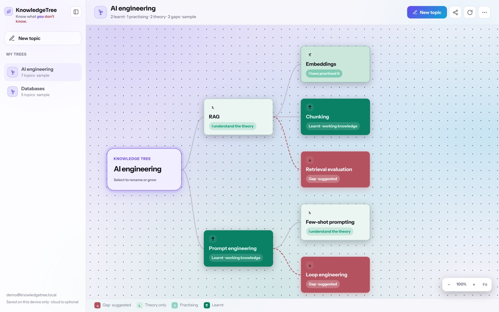

# KnowledgeTree

**Know what you don't know.**

KnowledgeTree is a personal knowledge organiser that maps learning as a visual tree. Break any subject into topics, track honest self-assessed progress from gap to learnt, attach notes and history, and see where your blind spots are.

Works **offline-first** on your device. Sign in to sync across devices and share trees with collaborators.



## Features

- **Visual knowledge trees** — zoomable canvas with branches and sub-topics
- **Learning stages** — gap → theory → practising → learnt (self-assessed, not quizzes)
- **Notes & history** — learning material and level transitions per topic
- **Local-first** — trees saved in the browser; cloud sync is optional
- **Cloud sync** — push/pull with optimistic versioning and conflict handling
- **Sharing** — invite by email with view or edit access
- **Import / export** — portable JSON workspace format
- **Sample trees** — AI engineering, databases, DevOps, and more

## Tech stack

| Layer | Technology |
|-------|------------|
| Backend | Python, [FastAPI](https://fastapi.tiangolo.com/), Uvicorn |
| Database | PostgreSQL (JSONB tree documents) |
| Auth | Email OTP + HTTP-only session cookies |
| Email | [Resend](https://resend.com/) (optional — required for OTP & share invites) |
| Frontend | Vanilla JavaScript (ES modules), HTML, CSS — no build step |
| Tests | pytest (backend), Node test runner (frontend logic) |

## Quick start

### Prerequisites

- Python 3.9+
- PostgreSQL
- Node.js (for frontend tests only)

### Setup

```bash
git clone https://github.com/VJag/knowledge_tree.git
cd knowledge_tree

python3 -m venv .venv
source .venv/bin/activate   # Windows: .venv\Scripts\activate
pip install -r requirements-dev.txt

cp .env.example .env
# Edit .env — set DATABASE_URL at minimum

python scripts/init_db.py
uvicorn app.main:app --reload --host 127.0.0.1 --port 8000
```

Open [http://127.0.0.1:8000](http://127.0.0.1:8000).

### Environment variables

| Variable | Required | Description |
|----------|----------|-------------|
| `DATABASE_URL` | Yes | PostgreSQL connection string |
| `SECRET_KEY` | Yes | Session & OTP hashing secret |
| `RESEND_API_KEY` | For email | Resend API key for OTP & share emails |
| `EMAIL_FROM` | For email | Verified sender address in Resend |
| `SESSION_TTL_HOURS` | No | Session lifetime (default 720) |
| `OTP_TTL_MINUTES` | No | OTP expiry (default 10) |
| `SECURE_COOKIES` | No | Set `true` in production (HTTPS) |

Without Resend configured, the app runs locally but sign-in codes cannot be emailed.

## Tests

```bash
# Backend
pytest

# Frontend logic
npm test
```

## Deployment

The included `Procfile` runs Uvicorn for platforms like Heroku or Railway:

```
web: uvicorn app.main:app --host 0.0.0.0 --port ${PORT:-8000}
```

Set `DATABASE_URL`, `SECRET_KEY`, `RESEND_API_KEY`, `EMAIL_FROM`, and `SECURE_COOKIES=true` in production.

## Project structure

```
app/           FastAPI routes, services, config
web/           Static frontend (HTML, CSS, JS)
db/            PostgreSQL schema and migrations
tests/         Backend tests
web/tests/     Frontend unit tests
scripts/       Database init, test runners
docs/          Screenshots and docs
```

## JSON format

A tree export looks like:

```json
{
  "version": 1,
  "trees": [
    {
      "name": "AI engineering",
      "topics": [
        {
          "name": "RAG",
          "level": 1,
          "children": [
            { "name": "Embeddings", "level": 2 },
            { "name": "Retrieval evaluation", "level": 0, "suggested": true }
          ]
        }
      ]
    }
  ]
}
```

Levels: `0` gap · `1` theory · `2` practising · `3` learnt. Set `"suggested": true` for suggested gaps.

## Contributing

Contributions welcome — see [CONTRIBUTORS.md](CONTRIBUTORS.md). Open an issue or pull request on GitHub.

## License

MIT — see [LICENSE](LICENSE).

## Author

Built by **[VJag](https://github.com/VJag)**.

If you're interested in taking KnowledgeTree further — features, design, education use, or open-source collaboration — open an issue or reach out via GitHub.
